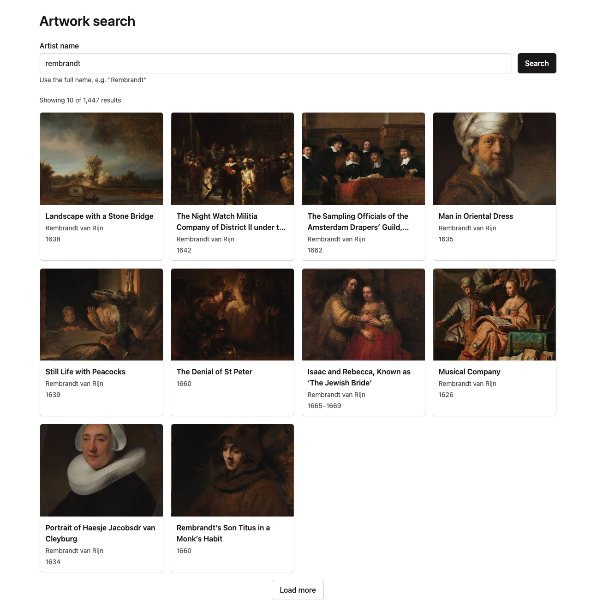

# Artwork Search

[](https://github.com/jorgetroya80/artwork-search/actions/workflows/ci.yml)
[](https://github.com/jorgetroya80/artwork-search/releases)
[](LICENSE)

A React + TypeScript search interface for the Rijksmuseum collection, built on the public
[Rijksmuseum Linked Art API](https://data.rijksmuseum.nl/).

<!-- TODO: replace with a screenshot or GIF of the search UI -->



<!-- TODO: add a link to the live demo once deployed -->

## Overview

- Search the collection by artist name. Results load 10 at a time with a "Load more" button.
- Each result shows the title, artists, date range and a thumbnail.
- Errors are handled per request: a failed search, a failed "Load more" and a failed artwork each
  get their own message and Retry action.
- The UI never sees Linked Art or JSON-LD. The data layer turns API responses into flat, typed
  `Artwork` objects.

## Architecture

The app uses a **feature-based layered architecture**. Code is grouped by feature, on
top of two shared layers: data and UI. Dependencies go one way: app shell → features → shared.
The shared layers never import from features.

```
┌─ App shell ────────────────────────────────────────────────┐
│  main.tsx    StrictMode · QueryClientProvider              │
│  App.tsx     root composition                              │
└─────────────────────────────┬──────────────────────────────┘
                              ▼
┌─ Feature: features/search ─────────────────────────────────┐
│  SearchPage   (container: local state + useArtworkSearch)  │
│   ├─ SearchForm          (presentational)                  │
│   └─ SearchResults       (presentational)                  │
│       ├─ ArtworkCard · ArtworkCardSkeleton                 │
│       └─ ErrorMessage                                      │
└──────────────┬──────────────────────────────┬──────────────┘
               ▼                              ▼
┌─ Shared: data ───────────────┐  ┌─ Shared: UI ─────────────┐
│ api/rijksmuseum (index.ts)   │  │ components/ui (index.ts) │
│  hooks    useArtworkSearch   │  │  Button · TextField      │
│           useArtwork         │  │  adapters over Base UI   │
│  cache    TanStack Query     │  │  Tailwind design tokens  │
│  fetch    http · parse       │  └──────────────────────────┘
│  errors   RijksApiError      │
└──────────────┬───────────────┘
               ▼
        Rijksmuseum API
```

| Layer        | Folder                | Role                                                     |
| ------------ | --------------------- | -------------------------------------------------------- |
| App shell    | `main.tsx`, `App.tsx` | Providers and root composition                           |
| Feature      | `src/features/search` | Search page and its domain components                    |
| Shared: data | `src/api/rijksmuseum` | Server state, fetchers, Linked Art parsing, typed errors |
| Shared: UI   | `src/components/ui`   | Design system: adapters over Base UI, Tailwind tokens    |
| Tests        | `src/test`            | Test setup, MSW handlers and recorded API fixtures       |

### Patterns

- **Container / presentational components.** `SearchPage` is the only container: it owns the
  state and calls the data hook. `SearchForm`, `SearchResults`, `ArtworkCard` and `ErrorMessage`
  receive everything through props.
- **Server state in custom hooks.** TanStack Query is wrapped in `useArtworkSearch` and
  `useArtwork`. Components never build query keys or call `fetch`.
- **Public API through barrel files.** `api/rijksmuseum/index.ts` and `components/ui/index.ts`
  define what each shared layer exports.
- **Adapter pattern for the UI library.** Feature code uses local wrappers, never Base UI
  directly.

### State management

- **Server state:** TanStack Query (cache, retries, cancellation, infinite queries).
- **UI state:** local `useState` (the search draft and the submitted term in `SearchPage`).
- **No global store.** The app has no shared client state, so Redux or Zustand would add
  nothing.

### Lint rules that protect the architecture

- `@base-ui/*` can be imported only in `src/components/ui`.
- Inside `src/components/ui`, Base UI is imported by subpath (`@base-ui/react/button`) for tree
  shaking.
- No `React.FC` and no `enum` (use `as const` or string unions).
- Type-only imports and exports use `import type` / `export type`.
- React Hooks rules, including the React Compiler rules and `exhaustive-deps`, are errors.
- Tailwind classes are checked against the theme in `src/index.css`.
- No `console` in source code.

Layer boundaries (one-way dependencies, imports only through `index.ts`) are a convention. Lint
does not check them yet.

## Architecture decisions

### 1. The API layer hides Linked Art

**Context:** The Rijksmuseum API returns Linked Art (JSON-LD). Titles, dates and artists are spread
across nested `identified_by`, `produced_by` and Getty AAT vocabulary IDs.

**Decision:** All parsing and normalization lives in `src/api/rijksmuseum`. The UI calls one hook,
`useArtworkSearch({ creator })`, and gets back resolved artworks, the total count, `loadMore`
and loading and error states.

**Trade-off:** The data layer is larger than a thin fetch wrapper, but the UI can change without
knowing the API format, and the API format can change without touching the UI.

### 2. Two-level pagination over a cursor API

**Context:** The search endpoint returns 100 IDs per page, behind an opaque cursor (`pageToken`).
There is no offset or page-size parameter. Showing 100 artworks at once is too many requests.

**Decision:** Two levels. API pages of 100 IDs are loaded with `useInfiniteQuery` and only
appended. The UI shows the first `visibleCount` IDs, which grows by 10 on each "Load more". A new
search request is sent only when the loaded IDs do not cover `visibleCount`: one request every 10
clicks.

**Trade-off:** No page numbers and no jump to page N. This matches the cursor-based API, which
cannot skip pages.

### 3. Per-artwork resolution with a shared entity cache

**Context:** A search result is only an ID. Resolving it takes several more requests (the object,
then linked entities such as artists), each about 100 KB.

**Decision:** Each artwork is its own query, so it loads, fails and retries on its own. Linked
entities get their own cache entry, because one artist is shared by many artworks. They also get
their own `AbortSignal`: cancelling one artwork must not cancel a request that another artwork
needs. Collection records rarely change, so resolved data uses `staleTime: Infinity`.

**Trade-off:** More queries in the cache, in exchange for fewer requests and independent error
states per card.

### 4. A typed error model

**Context:** Failures come from many places: HTTP status, network, timeout, invalid JSON and
unexpected IDs.

**Decision:** Every fetcher throws `RijksApiError`, with a `kind`
(`http | network | timeout | parse | invalid-id`) and a `retryable` flag. Network errors,
timeouts, `429` and `5xx` are retryable. The `QueryClient` retries only retryable errors (at most
2 times), and the UI picks the message and the Retry button from `kind`. Requests time out after
15 s, and `http.ts` rejects any URL outside the two Rijksmuseum API prefixes.

**Trade-off:** One more abstraction over `fetch`, but no error handling logic in components.

### 5. UI library behind wrappers, enforced by lint

**Context:** Coupling feature code to a UI library makes it expensive to replace.

**Decision:** [Base UI](https://base-ui.com/react) is imported only in `src/components/ui`. ESLint
rejects `@base-ui/*` imports anywhere else, and inside the wrappers it requires subpath imports
(`@base-ui/react/button`) so only the used parts are bundled.

**Trade-off:** Each new component needs a wrapper first. Replacing the library touches one
directory.

### 6. Network-free tests with a coverage threshold

**Context:** Tests that call a public API are slow and flaky.

**Decision:** Vitest and Testing Library run in jsdom. [MSW](https://mswjs.io/) serves recorded
API fixtures, so tests never call the real API. `pnpm test:coverage` fails when line coverage of
`src/api/rijksmuseum`, `src/features/search` or `src/components` is below 90%.

**Trade-off:** Fixtures must be updated by hand if the API response format changes.

### 7. Spec-driven workflow

**Context:** The API has non-obvious behavior: whole-word matching only, a cursor without page
size, titles indexed in Dutch and English.

**Decision:** Every feature starts with a spec, then a plan, then the implementation. API behavior
was verified with `curl` and recorded in the spec before any code was written.

**Trade-off:** Slower start on each feature, fewer surprises during implementation.

### 8. Supply-chain hygiene

**Decision:** Dependencies are pinned to exact versions (`saveExact: true`) and dependency build
scripts are disabled (`allowBuilds`). In CI, third-party actions are pinned by commit SHA, the
default token is read-only (`permissions: contents: read`) and installs use
`--frozen-lockfile`.

**Trade-off:** Updates are manual, on purpose.

### 9. Automated releases

**Decision:** Pull request titles must be [Conventional Commits](https://www.conventionalcommits.org/),
checked in CI. [release-please](https://github.com/googleapis/release-please) reads the commits on
`main` and opens a release PR that bumps the version (SemVer) and updates `CHANGELOG.md`. Merging
it creates the tag and the GitHub Release.

**Trade-off:** Commit messages must follow the format, but versions and changelogs need no manual
work.

## Tech stack

- **React 19** with React Compiler: automatic
  memoization, no manual `useMemo` or `useCallback`.
- **TypeScript 6** in strict mode.
- **Vite 8** for the dev server and build.
- **TanStack Query 5** for server state: caching, retries, cancellation and infinite queries.
- **Tailwind CSS 4** with semantic color and radius tokens in `src/index.css`.
- **Base UI** for accessible, unstyled primitives, behind local wrappers.
- **Vitest**, **Testing Library** and **MSW** for tests.
- **ESLint** and **Prettier**, with a pre-commit hook that runs `lint-staged`.
- **GitHub Actions** and **release-please** for CI and releases.

## Getting started

Requirements: Node.js `24.18.0` (see `.nvmrc`) and pnpm `12.8.1` (via Corepack). The Rijksmuseum
API is public and needs no API key.

```sh
nvm use
corepack enable
pnpm install
pnpm start        # http://localhost:3000
```

| Script               | Description                                   |
| -------------------- | --------------------------------------------- |
| `pnpm start`         | Start the dev server                          |
| `pnpm build`         | Type-check and build for production to `dist` |
| `pnpm preview`       | Serve the production build                    |
| `pnpm lint`          | Lint `src` with ESLint                        |
| `pnpm test`          | Run the tests once                            |
| `pnpm test:watch`    | Run the tests in watch mode                   |
| `pnpm test:coverage` | Run the tests with the 90% coverage threshold |

Search with a full artist name ("Rembrandt", not "Rembr"): the API matches whole words only.

## Known limitations and next steps

- Search matches whole words only. This is an API limitation: there is no prefix or wildcard
  search.
- Search by artist only. The data layer already supports `title`, but the UI does not expose it
  yet.
- No artwork detail view.
- No public deployment yet.

## License

[GPL-3.0](LICENSE)
